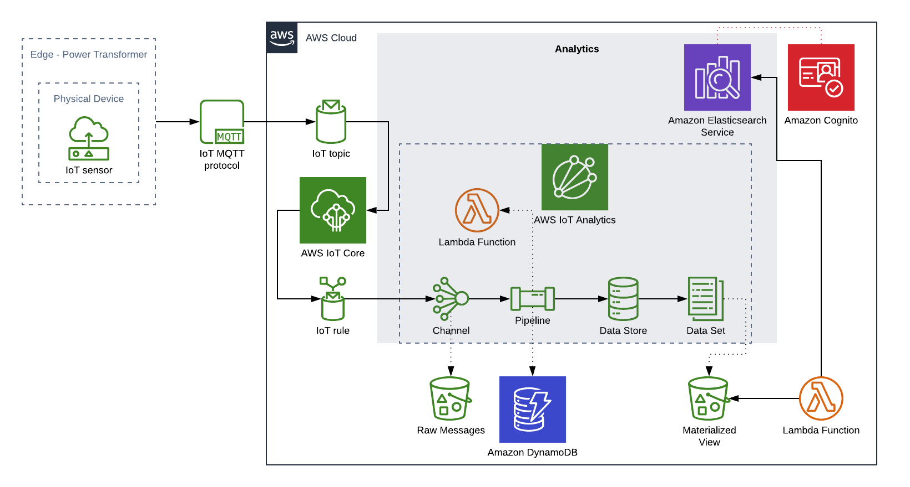
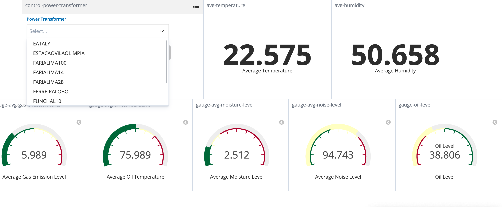

# IoT Analytics with ElasticSearch

## Overview

The goal of this project is to deploy, using AWS CDK, a sample stack to analyze sensor data from *Distribution Power Transformers*. The best way to simulate these *power transformers* is to use [IoT Device Simulator](https://aws.amazon.com/solutions/implementations/iot-device-simulator/), we have a sample script to configure devices using its API.

But you can use any code that can send messages to a Topic on AWS to simulate your devices.

## Components

- IoT Core: Role in the solution...

- IoT Analytics

- Lambda Functions

- DynamoDB

- S3

- Amazon ElasticSearch

- Amazon Cognito

- Kibana

## Kibana Dashboards

### Overview Dashboard

### Details Dashboard

### Alarms/Anomaly Detection

Kibana + SNS

## TODO

[See](TODO.md)

